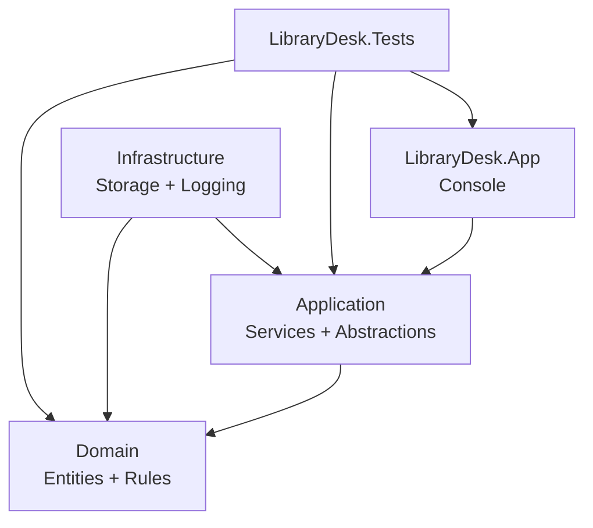

# Архітектура LibraryDesk

Документ описує цільову архітектуру СР-3 для варіанта 2. Рішення використовує дозволену методичними вказівками схему з трьома основними проєктами: бібліотека логіки, консольний застосунок і тести. Усередині бібліотеки межі домену, прикладного шару та інфраструктури позначено просторами імен і теками.

## 1. Шари та обмеження

| Шар | Розташування | Відповідальність | Заборонено |
|---|---|---|---|
| Домен | `LibraryDesk.Core/Domain`, `Errors`, `Pricing` | Інваріанти сутностей, життєвий цикл формуляра, строк і пеня | Знати про консоль, JSON, файли, журнал або конкретне сховище |
| Прикладний | `LibraryDesk.Core/Services`, `Abstractions`, `Reports` | Оркестрація UC-01–UC-06, порти сховищ і часу, пошук і підготовка звітів | Читати консоль, знати шлях до файла або формат JSON |
| Інфраструктура | `LibraryDesk.Core/Storage` | Реалізації сховищ JSON/у пам’яті та файлового журналу | Містити правила строку, пені або переходів станів |
| Застосунок | `LibraryDesk.App` | Меню, перетворення вводу, форматування виводу, композиційний корінь | Обчислювати пеню, змінювати стани в обхід сервісу, серіалізувати доменні об’єкти |
| Тести | `LibraryDesk.Tests` | Перевірка домену, сценаріїв, архітектури та критеріїв якості | Залежати від порядку виконання або реального системного часу |

`LibraryDesk.Core` свідомо лишається однією бібліотекою: проєкт невеликий, а окремих реалізацій інфраструктури лише дві. Ризик випадкової залежності домену від інфраструктури контролює архітектурний тест і перевірка CI.

## 2. Схема залежностей



**Рисунок 1 — Схема залежностей проєктів і шарів LibraryDesk.**

- `LibraryDesk.App → Application`: консоль викликає сценарії через прикладний фасад.
- `Application → Domain`: сервіси координують сутності та чисті правила домену.
- `Infrastructure → Application`: конкретні сховища реалізують інтерфейси, оголошені прикладним шаром.
- `Infrastructure → Domain`: адаптери відновлюють і зберігають стан доменних сутностей, але домен не знає про адаптери.
- `LibraryDesk.Tests → шари`: тести можуть бачити код продукту; зворотної залежності немає.

У файлах проєктів є лише напрямки `LibraryDesk.App → LibraryDesk.Core` і `LibraryDesk.Tests → LibraryDesk.Core`. `LibraryDesk.Core` не посилається на застосунок або тести. На рівні просторів імен типи `LibraryDesk.Core.Domain` не використовують `Storage`, `System.Console`, `System.Text.Json` чи `System.IO`.

## 3. Композиційний корінь

Конкретні реалізації створюються в одному місці — на початку `Program.cs`. Цільовий фрагмент після завершення реалізації:

```csharp
string dataPath = Path.Combine(AppContext.BaseDirectory, "data", "library.json");
IClock clock = new SystemClock();
ILibraryRepository repository = new JsonLibraryRepository(dataPath);
IScenarioLogger scenarioLog = new FileScenarioLogger("librarydesk.log", clock);
LateFeePolicy lateFee = new();
LibraryService service = new(repository, clock, lateFee, scenarioLog);
ConsoleApplication application = new(service, Console.In, Console.Out);
application.Run();
```

**Лістинг 1 — Композиційний корінь консольного застосунку.**

Створення об’єктів зібрано тут, щоб прикладний і доменний код отримували залежності через конструктор і не знали, чи дані зберігаються у JSON, пам’яті або іншому джерелі. Тести підставляють фейкове сховище та фіксований годинник без зміни робочих класів.

## 4. Правило залежностей

Правило формулюється так: код, ближчий до домену, не залежить від способу введення, зберігання й виведення.

1. Домен приймає вже типізовані `decimal`, `DateOnly`, `DateTimeOffset` та ідентифікатори.
2. Прикладний сервіс перевіряє запит на межі й викликає доменні операції.
3. Інтерфейси `ILibraryRepository`, `IClock` та `IScenarioLogger` оголошено всередині бібліотеки логіки.
4. JSON, файл журналу й `Console` є замінними деталями зовнішнього шару.
5. `ArchitectureTests` перевіряє відсутність заборонених посилань у публічній поверхні доменних типів.

Якщо домен почне читати JSON або консоль, його не можна буде перевірити ізольовано, а зміна формату даних змусить змінювати бізнес-правила. Тому така залежність вважається дефектом, навіть якщо рішення компілюється.

## 5. Потік одного сценарію

Для UC-03 «Видати книжку» напрямок викликів такий:

1. `ConsoleApplication` перетворює текст на `IssueBookRequest`.
2. `LibraryService.IssueBook` одноразово перевіряє запит і завантажує читача та книгу через порт сховища.
3. `LoanTermsPolicy` визначає строк, а `Loan` виконує дозволений перехід `Draft → Active`.
4. `LibraryService` зберігає узгоджений стан і пише події Information або Warning через `IScenarioLogger`.
5. Консоль лише форматує отриманий `IssueBookResult`.

Транзакційної бази даних у межах роботи немає. JSON-адаптер записує повний узгоджений знімок через тимчасовий файл і заміну, що зменшує ризик частково записаних даних.

## 6. Точки розширення

| Передбачувана зміна | Механізм | Що додається | Що не змінюється |
|---|---|---|---|
| Інший спосіб зберігання, наприклад CSV | Інтерфейс `ILibraryRepository` | Нова реалізація адаптера і один рядок композиційного кореня | Домен, сценарії, тести правил |
| Інший порядок нарахування пені | Стратегія `ILateFeePolicy` | Нова політика й тести таблиці рішень | `Loan`, сховище, консольне меню |
| Інший формат звіту боржників | Чистий форматер `IDebtorReportFormatter` | CSV або Markdown-форматер | Відбір боржників і розрахунок пені |
| Керований час у тестах або планувальнику | Інтерфейс `IClock` | `FixedClock` або інший адаптер | Сервіс і доменні сутності |

## 7. Відображення сценаріїв на прикладний API

| Сценарій | Метод сервісу | Основний результат |
|---|---|---|
| UC-01 | `RegisterBook` | Книга створена або поповнена |
| UC-02 | `RegisterReader` | Читача зареєстровано |
| UC-03 | `IssueBook` | Активний формуляр і строк повернення |
| UC-04 | `ReturnBook` | Завершений формуляр і сума пені |
| UC-05 | `SearchLoans` | Відсортований незмінний список |
| UC-06 | `BuildDebtorReport` | Рядки звіту станом на дату |

Методи повертають результат для очікуваної помилки вводу, а порушення життєвого циклу вже створеної сутності виражають `DomainRuleException`. Це відокремлює помилку користувача, правило домену і помилку програміста.
